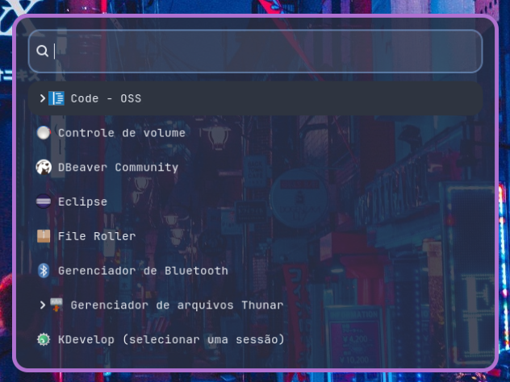
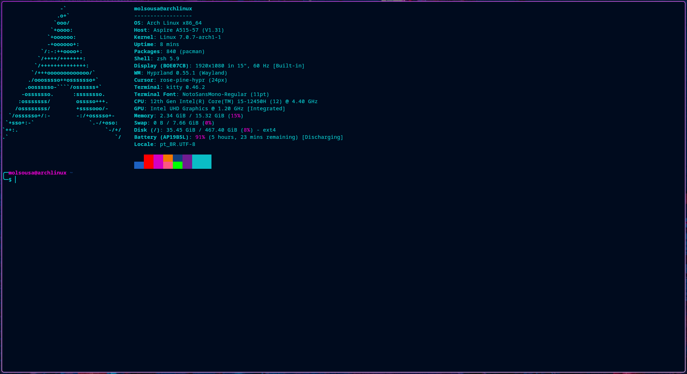
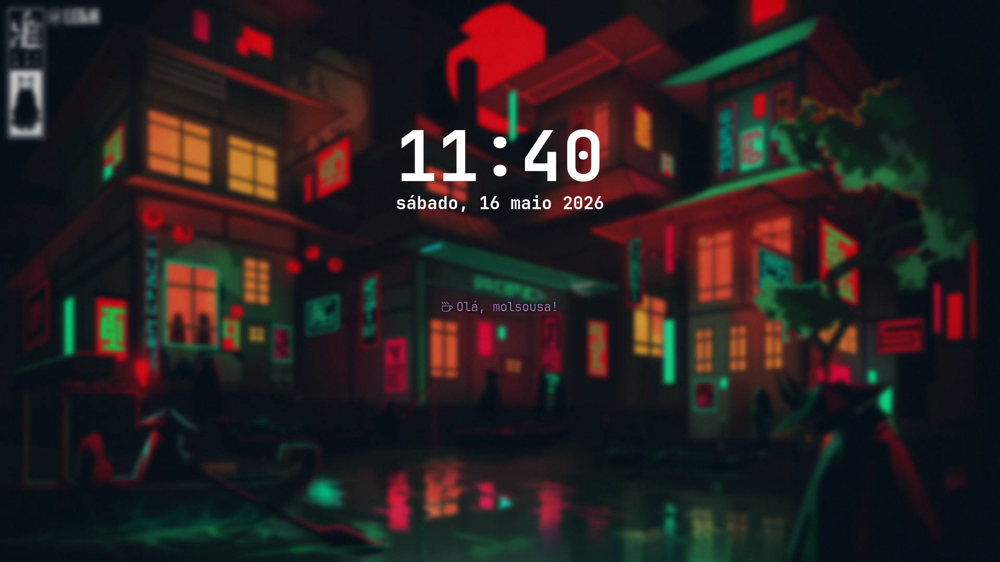

## Meus dotfiles para Hyprland no Archlinux

Mistura de outros dotfiles com personalizações

### [Waybar](https://github.com/cybrcore/cybr-waybar)

### [Wofi](https://github.com/7KIR7/dots/tree/main/wofi)

### Terminal

### [Hyprlock](https://github.com/MrVivekRajan/Hyprlock-Styles/tree/main/Style-9)

