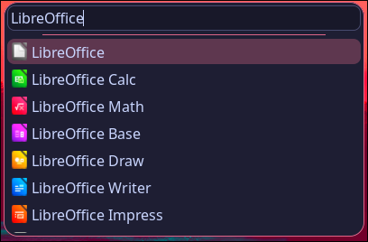
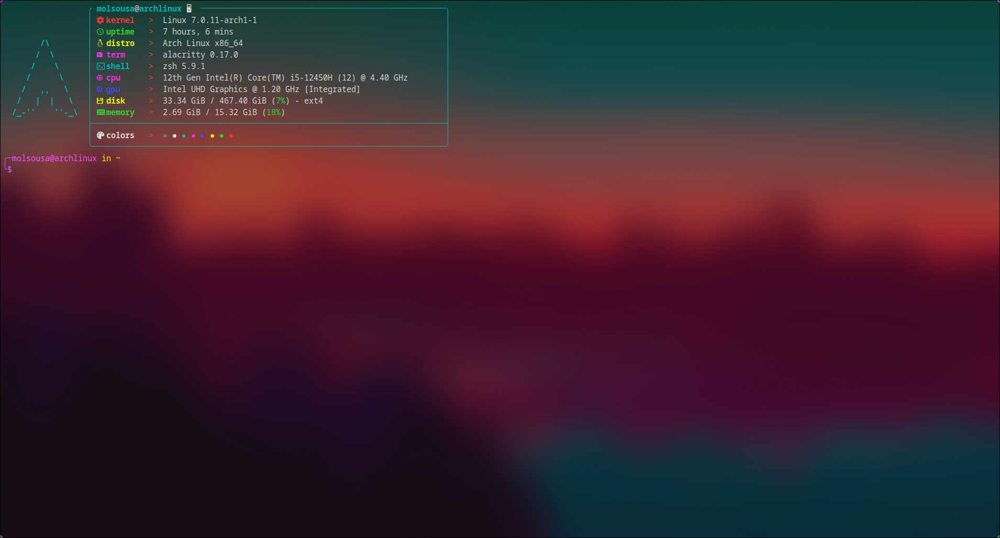
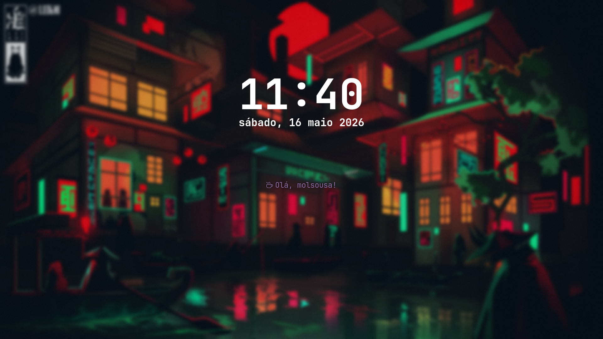

## Meus dotfiles para Hyprland no Archlinux

Mistura de outros dotfiles com personalizações.


### [Waybar](https://github.com/haikal-hakim/athena/tree/main/.config/waybar)


### Hyprlauncher




### Terminal




### [Hyprlock](https://github.com/MrVivekRajan/Hyprlock-Styles/tree/main/Style-9)



## Configuração do sistema

### AUR

```sh
sudo pacman -S --needed git base-devel

git clone https://aur.archlinux.org/yay.git

cd yay

makepkg -si
```

### Pacotes

- **Hyprpaper:** gerenciador de papel de parede.

- **Hyprlock:** gerenciador de tela de bloqueio.

- **Hyprshot:** aplicação pra captura de tela.

- **Hyprlauncher:** lançador de aplicativos.

- **Thunar:** gerenciador de arquivos.

- **Waybar:** barra de tarefas.

- **Pipewire:** gerenciador de áudio.

- **Bluez:** gerenciador do bluetooth.

```sh
sudo pacman -S hyprpaper

sudo pacman -S hyprlock

sudo pacman -S hyprshot-rs

sudo pacman -S hyprlauncher

sudo pacman -S thunar thunar-archive-plugin

sudo pacman -S waybar

sudo pacman -S pipewire

sudo pacman -S bluez bluez-utils
```

### Fontes

```sh
sudo pacman -S noto-fonts noto-fonts-emoji noto-fonts-cjk

sudo pacman -S ttf-liberation

sudo pacman -S ttf-jetbrains-mono-nerd

yay -S otf-font-awesome

yay -S ttf-nerd-fonts-symbols

yay -S ttf-geist-mono
```

### Caso não tenha o terminal

Emulador de terminal acelerado por GPU.

```sh
sudo pacman -S alacritty
```

### Caso não tenha o zsh

Interpretador de comandos.

```sh
sudo pacman -S zsh

sudo pacman -S zsh-autosuggestions zsh-syntax-highlighting
```
